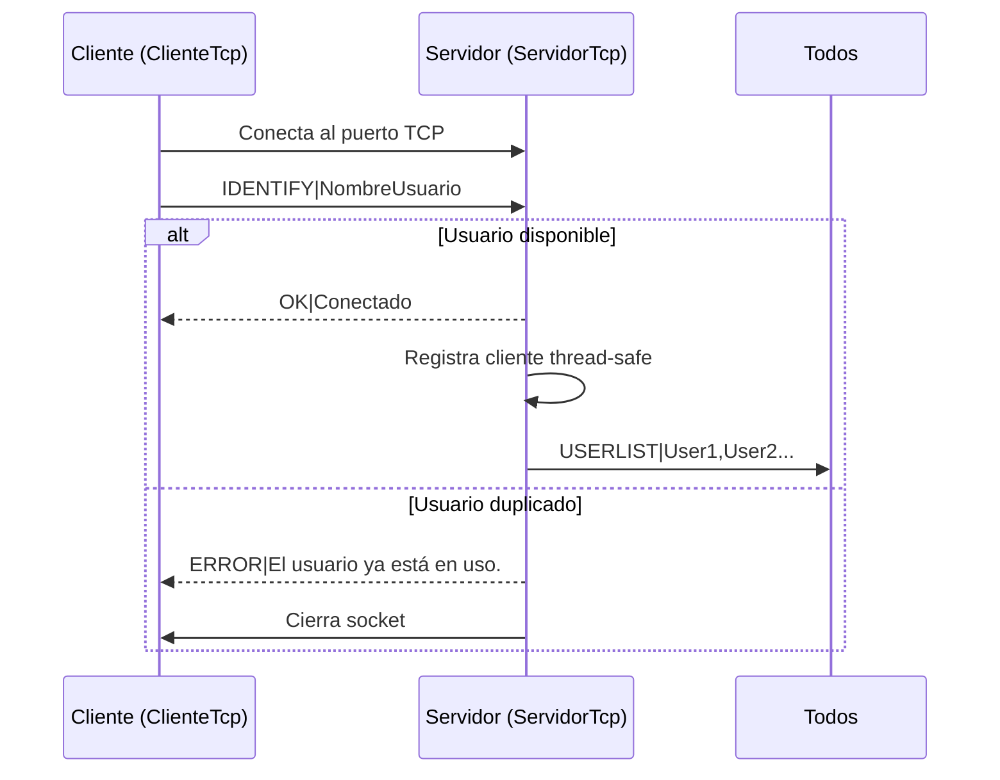
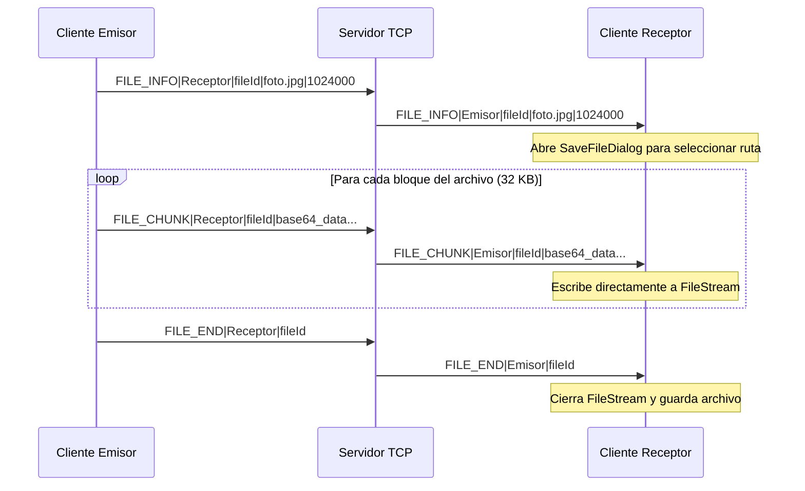

# Sockets y Conexiones en C# - Servidor y Cliente TCP Multihilo

Este repositorio contiene una aplicación de escritorio desarrollada en **C# con Windows Forms (.NET 8.0)** que implementa un sistema robusto de comunicación cliente-servidor mediante sockets TCP nativos (`System.Net.Sockets`). El sistema está diseñado para soportar chat en tiempo real (público y privado) y la transferencia segura de archivos pesados de forma segmentada.

---

## 🚀 Características Clave

*   **Arquitectura Multihilo**: El servidor gestiona múltiples conexiones simultáneas de forma no bloqueante utilizando programación asíncrona (`async/await`) y asignando tareas independientes para cada cliente.
*   **Chat en Tiempo Real**:
    *   **Mensajería Global**: Difusión de mensajes a todos los usuarios conectados (Broadcast).
    *   **Mensajería Privada**: Envío directo de mensajes privados dirigidos a un usuario específico.
    *   **Lista Dinámica**: Sincronización y actualización automática en tiempo real de la lista de usuarios conectados.
*   **Transferencia de Archivos Robusta**:
    *   **Envío Segmentado (Chunks)**: Los archivos se leen y transmiten en bloques de 32 KB codificados en Base64 para garantizar la integridad de los datos.
    *   **Semáforo de Escritura**: Controla de forma concurrente el acceso al flujo de red para que el envío de un archivo pesado no interrumpa ni mezcle los bytes de los mensajes de chat.
    *   **Guardado Seguro**: Diálogos interactivos con control de colisión de archivos (`Archivo (1).ext`), sanitización de nombres para evitar Path Traversal y borrado de archivos temporales si la transferencia falla.
*   **Interfaz de Usuario Moderna**:
    *   Soporte dinámico para **Modo Oscuro** y **Modo Claro**.
    *   Consola de logs coloreada por nivel de gravedad (`Info`, `Success`, `Error`).
    *   Control de memoria que recorta automáticamente el historial de la consola para evitar fugas de memoria.

---

## 🛠️ Arquitectura del Sistema

El sistema utiliza un protocolo basado en texto plano delimitado por líneas (`\r\n`). 

### Flujo de Conexión e Identificación


### Flujo de Transferencia de Archivos (Pass-through)
El servidor actúa como puente de datos en tiempo real (no almacena datos en el disco del servidor):


---

## 📋 Protocolo de Mensajería (Especificación)

Los paquetes de red viajan como texto UTF-8 finalizado en salto de línea. Los comandos soportados son:

| Comando | Dirección | Descripción |
| :--- | :--- | :--- |
| `IDENTIFY\|<usuario>` | Cliente ➔ Servidor | Envía el nombre del usuario para el registro. |
| `OK\|Conectado` | Servidor ➔ Cliente | Confirma que la conexión y el nombre son válidos. |
| `ERROR\|<mensaje>` | Servidor ➔ Cliente | Informa sobre errores (ej. usuario duplicado). |
| `USERLIST\|usr1,usr2` | Servidor ➔ Cliente | Envía la lista de usuarios activos para actualizar la UI. |
| `PING` / `PONG` | Ambos sentidos | Mensajes de latido para verificar que la conexión sigue activa. |
| `MSG\|<destino>\|<texto>` | Ambos sentidos | Envía texto de chat. `<destino>` puede ser `ALL` o el nombre del usuario. |
| `FILE_INFO\|<destino>\|<id>\|<nom>\|<tam>` | Ambos sentidos | Notifica los metadatos de un archivo entrante. |
| `FILE_CHUNK\|<destino>\|<id>\|<b64>` | Ambos sentidos | Envía un fragmento del archivo codificado en Base64. |
| `FILE_END\|<destino>\|<id>` | Ambos sentidos | Informa que la transferencia del archivo ha finalizado. |
| `DISCONNECT` | Cliente ➔ Servidor | Cierra la conexión de forma limpia. |
| `SERVER_SHUTDOWN` | Servidor ➔ Cliente | Informa del cierre inmediato del servidor. |

---

## 💻 Requisitos y Ejecución

### Requisitos
*   **.NET SDK 8.0** o superior instalado en el equipo.
*   Sistema Operativo Windows (requerido para ejecutar Windows Forms nativo).

### Compilación y Ejecución (CLI)
1. Abre tu terminal o consola de comandos en el directorio raíz del proyecto.
2. Restaura las dependencias e inicia el compilador:
   ```bash
   dotnet restore
   dotnet build
   ```
3. Ejecuta la aplicación:
   ```bash
   dotnet run
   ```

### Ejecución en Visual Studio 2022
1. Abre el archivo de proyecto `SERVIDORES SOCKETS.csproj`.
2. Presiona `F5` o haz clic en el botón de **Iniciar** para depurar y ejecutar.

---

## 📁 Estructura del Código

*   [Form1.cs](file:///c:/Users/Usuario/Desktop/SERVIDORES%20SOCKETS/Form1.cs): Controla el formulario principal, actualiza los componentes de interfaz gráfica de forma segura utilizando delegados e `Invoke`, y maneja la alternancia del tema gráfico.
*   [ServidorTcp.cs](file:///c:/Users/Usuario/Desktop/SERVIDORES%20SOCKETS/ServidorTcp.cs): Contiene la lógica del socket oyente y la retransmisión de datos entre sockets conectados.
*   [ClienteTcp.cs](file:///c:/Users/Usuario/Desktop/SERVIDORES%20SOCKETS/ClienteTcp.cs): Controla el socket de conexión saliente, la serialización de escrituras, la codificación en chunks y la escritura directa a disco de archivos entrantes.
*   [ClienteConectado.cs](file:///c:/Users/Usuario/Desktop/SERVIDORES%20SOCKETS/ClienteConectado.cs): Modela la sesión de cada cliente conectado del lado del servidor.
